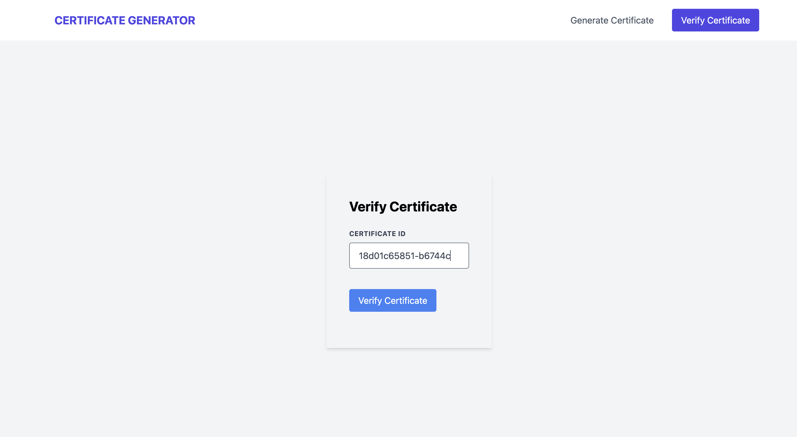

# Certificate Issuing and Verifying Application


## Table of Contents
- [Overview](#overview)
  - [Prerequisites](#prerequisites)
  - [Project Structure](#project-structure)
  - [Installation](#installation)
- [How It Works](#how-it-works)
  - [Illustrations](#illustrations)

## Overview
- Certificate Generator & Verifying Application is a powerful and user-friendly web application that simplifies the process of creating and verifying certificates.

### Prerequisites
Before you start, make sure you have the following software and tools installed on your machine:

- [Node.js](https://nodejs.org/) - JavaScript runtime (includes npm)
- [Git](https://git-scm.com/) - Version control system

## Project Structure

The project is organized as follows:

- **client/:** Contains the frontend code built with [React](https://reactjs.org/).
  - **src/:** Main source code for the React app.
    - **components/:** Reusable React components used throughout the application.
    - **configs/:** All the configs are present here.
    - **pages/:** React components representing different pages in the application.
    - **services/:** Different services layer for different APIs.
    - **utils/:** Utility functions or helper modules.
    - **...

- **server/:** Houses the backend logic developed with [Node.js](https://nodejs.org/).
  - **src/:** Main source code for the Node.js server.
    - **controllers/:** Controllers handling route logic and business logic.
    - **models/:** Data models or database schemas.
    - **routes/:** Route definitions for the API.
    - **common/:** Shared or common modules and functionalities.
    - **middlewares/:** Express.js middlewares for request handling.
    - **validator/:** Validation functions for input data.
    - **...

- **docs/:** Documentation files, including this README.md.

- **...


### Installation
```bash
# Clone the repository
git clone https://github.com/basitbc/Certificate-Issuing-and-Verifying-App.git

# Navigate to the server folder
cd server

# Install server dependencies
npm install

# Start the server (default port: 9000)
npm start


# Open a new terminal and navigate to the client folder
cd client

# Install client dependencies
npm install

# Start the client (default port: 3000)
npm start
```

## How It Works


### Certificate Issuing

Here are the steps involved in issuing a certificate:

1. Users fill out the form on the Certificate Issuing Page.
2. Details such as Recipient's Name, Course Name, Issuer's Name, and Date of Issue are submitted.
3. The backend API processes the data and generates a unique certificate ID.
4. The certificate is stored in the in-memory data storage.

### Certificate Verification

Here are the steps for verifying a certificate:

1. Users input a unique certificate ID on the Certificate Verification Page.
2. The backend API checks if the certificate with that ID exists.
3. If the certificate is found, its details are displayed, including Recipient's Name, Course Name, Issuer's Name, and Date of Issue.
4. A error message indicates the certificate ID is not valid.

### Illustrations

#### Certificate Issuing Process
- Illustration of the Certificate Issuing Process


*Users input details such as Recipient's Name, Course Name, Issuer's Name, and Date of Issue and generates certificate*


*The backend generates a unique certificate ID and displays the certificate. Keep note of the Certificate ID*


#### Certificate Verification Process
- Illustration of the Certificate Verification Process 


*Users enter a certificate ID for verification*


*The system displays details if the certificate is valid or else shows Certificate ID not valid*
